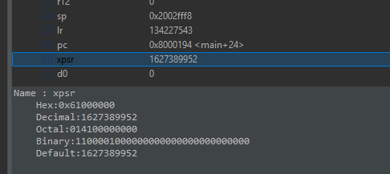
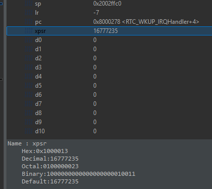
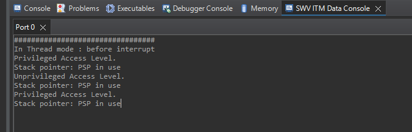
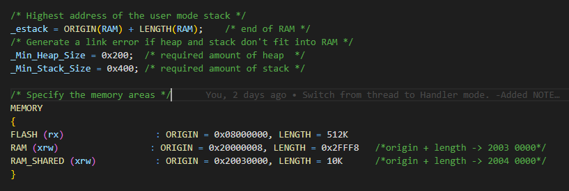

**PSR Register**  
*Change in CPU register indicates which exception occured.*  

*Thread mode*  
  
  
  
*Handler mode*(Sys exception or IRQ)  
  
  
  
**Function calls**  
  
08000192:   bl      0x80001a8 <generate_interrupt>  
  
080001d2:   bx      lr  
  
- **LR**: Holds the return address when a function call (BL or BLX) is made.  
  
- When branching (BL), **PC** is updated with the target address, while LR stores the return address.  
  
On the ARM Cortex‑M4, when the processor enters Handler mode (e.g., during an interrupt or exception),  
the Link Register (LR) doesn’t hold a normal return address.   
Instead, it is loaded with a special “EXC_RETURN” value — which looks like a “negative” value because its high bits are set.  
*(e.g., 0xFFFFFFF9, 0xFFFFFFFD, 0xFFFFFFF1)*.  
  
*Activity 1*:
   
(A) Write a program to get **CONTROL Register** Info.  
- Gives info about access levels and Stack pointer use.  
  
  
(B) Change MSP to PSP:  
SP -> PSP for thread mode.  [Application]  
SP -> MSP for handler mode. [Interrupts/Exceptions]  
  
With this setup, your Thread mode code runs on PSP, while interrupts continue to use MSP. This mirrors how industrial RTOSes manage stacks.  
  
(C) Switch Privilege to UnPrivilege access level.  
  
(D) Generate an interrupt to switch back to Privilege access level.  
  
Output of Activity 1:
  

  
**Memory**  
In this STM board, 1Mbyte of flash memory, 256 Kbytes of SRAM 
  
**Usable size = End address - Origin address + 1**  
- Usable flash size = End address - Origin address + 1
0x08000000 + (512*1024) =  808 0000(in decimal: 262,136 bytes)  
808 0000 -  0x08000000 =  8 0000 + 1 (in dec: 5,24,289)  
divide by 1024 -> 512kb SRAM  
  
- Usable ram size = End address - Origin address + 1  
2004 0000 - 2000 0008 =   3 FFF8 (in decimal: 262,136 bytes)  
divide by 1024 -> 255Kb SRAM  
  

  
  
  

