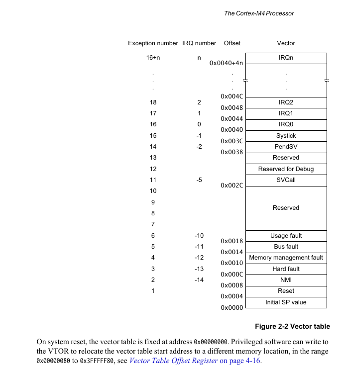
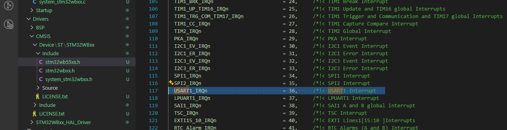

#### The NVIC (Nested Vectored Interrupt Controller) in ARM Cortex‑M4 is the hardware block that manages interrupts.
  
ISER (Interrupt Set Enable Register)  
ICER (Interrupt Clear Enable Register)  
ISPR (Interrupt Set Pending Register)  
ICPR (Interrupt Clear Pending Register)  
IABR (Interrupt Active Bit Register)  

**🧩 Pending State in NVIC**  
When an interrupt is triggered (by hardware or software), it doesn’t immediately execute. Instead, it enters the pending state in the NVIC.
- Pending = waiting to be serviced.
- The processor checks if:
- The interrupt is enabled (via ISER).
- Its priority is higher than the currently running code.
- If both conditions are met, the interrupt moves from pending → active and the ISR (Interrupt Service Routine) runs.  
  
  
## Exercise:  
(A) Enabling and Pending of USART1 Interrupt.  

Steps:
1. Identify the IRQ no. of the peripheral by referring to the MCU vector table. IRQ nos. are vendor specific.
  

  

2. Program the processor register to enable that IRQ.  
3. Configure the peripheral configuration register. Wheneve pkt is rcvd, it will automatically issue an
   interrupt on IRQ line 36.
4. When the interrupt is issued on the IRQ line, it will get pended in the pending register of the processor.
5. NVIC will allow the IRQ handler associated with the IRQ num to run only if the priority of the new interrupt
   is higher than currently executing Interrupt handler. Otherwise newly arrived interrupt will stay in pending state.
-> if peripheral issues an interrupt when the IRQ no. is disabled, then still interrupt will get pended in the    pending register of the NVIC. As soon as IRQ is enabled, it will trigger the execution of ISR if its priority is higher.  
  
