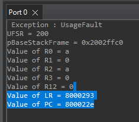

# How to Debug: Divide by Zero Exception

## 1. Context: UsageFault Handler

When a divide by zero occurs, the `UsageFault_Handler_c(uint32_t *pBaseStackFrame)` is triggered.



## 2. Analyzing the Fault

- Compare the memory region and instruction address with the list file:
  - Path: `STM32_LearningProject/03_Fault_Handling_Prog/Debug/03_Fault_Handling_Prog.list`
- Example: Value of PC (Program Counter) = `0x800022e`

### Disassembly at Fault Address
```
800022e: fb92 f3f3   sdiv r3, r2, r3
```
- **SDIV Rd, Rn, Rm**
  - `Rd`: destination register (result)
  - `Rn`: dividend (numerator)
  - `Rm`: divisor (denominator)

## 3. Register Values

- From the output, check the values of `r2` and `r3`:
  - `r2 = a`
  - `r3 = 0`

**Result:** This shows a divide by zero occurred (denominator is zero).


