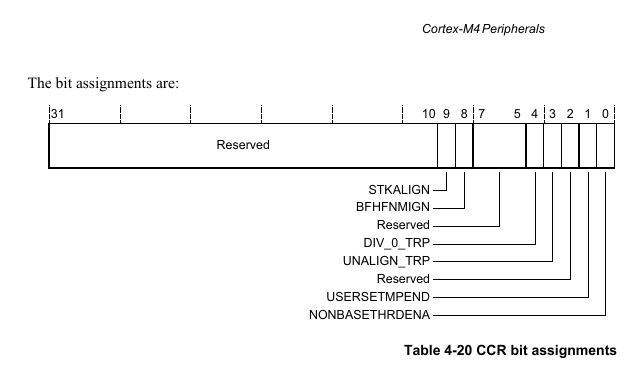

# Fault Handling on ARM Cortex-M4

## Hard Fault Exception

A Hard Fault exception is a catch‑all mechanism triggered when the CPU encounters an error it cannot handle with more specific fault types. It’s essentially the “last resort” exception handler.

### What Triggers a Hard Fault
- **Escalated faults:** If a BusFault, UsageFault, or MemManage fault occurs but is disabled or cannot be handled, it escalates into a HardFault.
- **Vector table errors:** Invalid vector table entries or corrupted stack pointers.
- **Execution errors:** Attempting to execute instructions from an invalid memory region.
- **Access violations:** Dereferencing invalid pointers or accessing restricted memory.
- **Divide by zero:** If not trapped by UsageFault.

## System Control Block (SCB) & SHCSR

On the ARM Cortex‑M4, the System Control Block (SCB) contains several key registers that control exception handling, system configuration, and fault management. The System Handler Control and State Register (SHCSR) is particularly important for enabling and monitoring system exceptions.

### SHCSR: System Handler Control and State Register

| Bit  | Name         | Function                                 |
|------|--------------|------------------------------------------|
| 0    | MEMFAULTACT  | Indicates MemManage fault handler active |
| 1    | BUSFAULTACT  | Indicates BusFault handler active        |
| ...  | ...          | ...                                      |
| 16   | USGFAULTENA  | Enables UsageFault exception             |
| 17   | BUSFAULTENA  | Enables BusFault exception               |
| 18   | MEMFAULTENA  | Enables MemManage exception              |

## Naked Functions in ARM Cortex-M (GCC)

In ARM Cortex‑M development, the `__attribute__((naked))` function attribute is a special GCC extension that tells the compiler:
- Do not generate standard function prologue/epilogue code.

Normally, when you enter a function, the compiler pushes registers onto the stack, sets up the frame pointer, and when exiting, it restores them. A naked function skips all of that.

### Why Naked Functions Exist

Naked functions are designed for low‑level, hand‑written assembly routines where you want full control over what happens at entry and exit. Common use cases include:
- **Interrupt handlers:** Custom stack frame manipulation.
- **RTOS kernels:** Context switching (saving/restoring registers manually).
- **Bootloader/startup code:** Avoid compiler‑inserted overhead.
- **Fault handlers:** Extract stacked registers directly.

## Configuration and Control Register (CCR)

The Configuration and Control Register (CCR) is one of the key registers in the System Control Block (SCB) of ARM Cortex‑M processors. It defines certain system behaviors and fault‑trapping options, giving you control over how the CPU responds to specific conditions.

The CCR allows you to:
- Decide whether the CPU should trap divide‑by‑zero and unaligned accesses
- Control how exceptions interact with Thread mode
- Enforce stack alignment

Enabling these traps makes debugging much easier and helps ensure your embedded software behaves predictably.