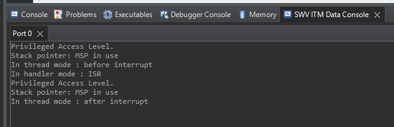

**PSR Register**  
*Change in CPU register indicates which exception occured.*  

*Thread mode*  
  
  
  
*Handler mode*(Sys exception or IRQ)  
  
  
  
**Function calls**  
  
08000192:   bl      0x80001a8 <generate_interrupt>  
  
080001d2:   bx      lr  
  
- **LR**: Holds the return address when a function call (BL or BLX) is made.  
  
- When branching (BL), **PC** is updated with the target address, while LR stores the return address.  
  
On the ARM Cortex‑M4, when the processor enters Handler mode (e.g., during an interrupt or exception),  
the Link Register (LR) doesn’t hold a normal return address.   
Instead, it is loaded with a special “EXC_RETURN” value — which looks like a “negative” value because its high bits are set.  
*(e.g., 0xFFFFFFF9, 0xFFFFFFFD, 0xFFFFFFF1)*.  
  
(A) Write a program to get **CONTROL Register** Info.  
- Gives info about access levels and Stack pointer use.  
  
  
(B) Switch Privilege to UnPrivilege access level.  
  
(C) Lets change:  
SP -> PSP for thread mode.  [Application]  
SP -> MSP for handler mode. [Interrupts/Exceptions]  
  
With this setup, your Thread mode code runs on PSP, while interrupts continue to use MSP. This mirrors how industrial RTOSes manage stacks.  
  

